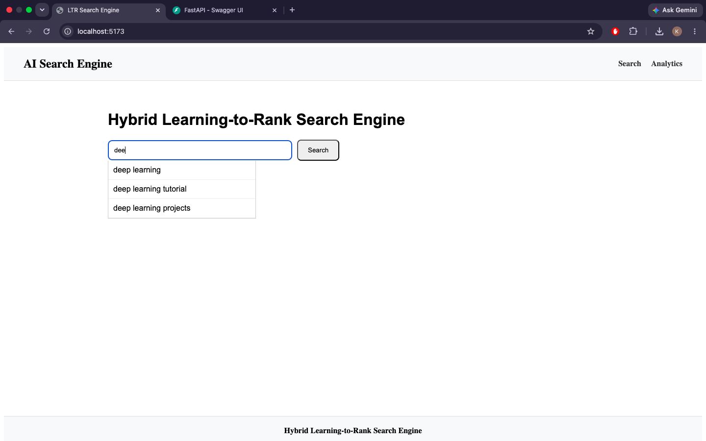
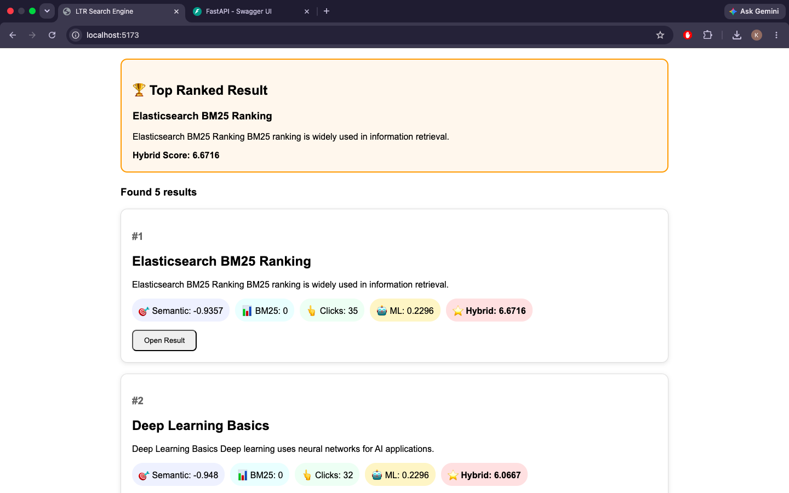
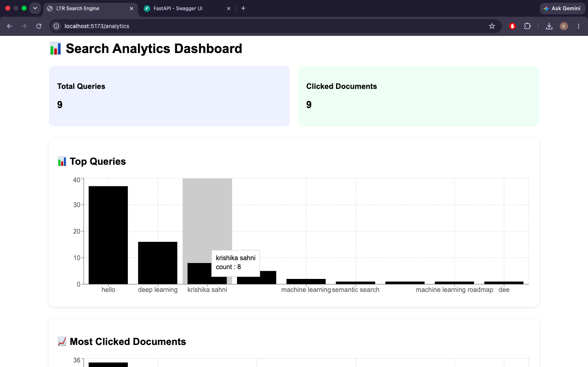
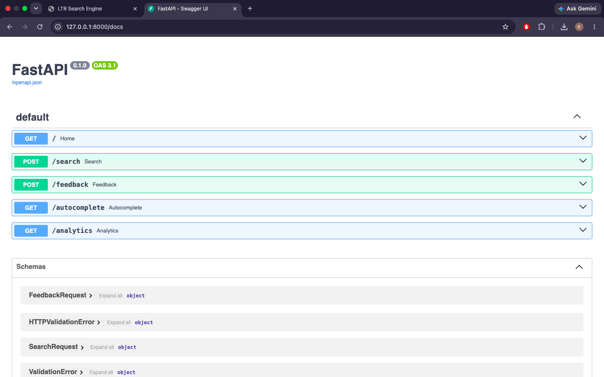

# Hybrid Learning-to-Rank Search Engine

A full-stack AI-powered search engine that combines Semantic Search, BM25 Ranking, Click Feedback Signals, and Machine Learning-based Learning-to-Rank (LTR) to improve search relevance.

This project demonstrates how modern search engines rank results using multiple signals instead of relying on keyword matching alone. The system combines:

* Semantic Search using Sentence Transformers
* BM25 Keyword Ranking
* User Click Feedback
* Machine Learning Ranking Model
* Query Autocomplete
* Analytics Dashboard

The final ranking score is generated using a hybrid approach that combines all signals.

## Features

### Search Engine

* Semantic Search using embeddings
* BM25 keyword matching
* Hybrid ranking
* Query autocomplete
* Search result ranking
* Top-ranked result highlighting

### Learning-to-Rank

* Click feedback collection
* Positive and negative training samples
* ML ranking model using Scikit-Learn
* Ranking score prediction

### Analytics Dashboard

* Top search queries
* Most clicked documents
* Interactive charts
* Search statistics

## 📷 Screenshots

### Home Page with Search Interface and Autocomplete Suggestions


### Hybrid Ranking Results


### Analytics Dashboard


### FastAPI API Documentation


## Hybrid Ranking Formula

The final ranking score combines:

```text
Hybrid Score =
0.4 × Semantic Score
+ 0.2 × BM25 Score
+ 0.2 × Click Score
+ 0.2 × ML Rank Score
```

## Machine Learning Ranking

Training features:

* Query Length
* Title Length
* Click Labels

Model:

* Random Forest Classifier

Output:

* Ranking Probability Score

## Analytics

The dashboard provides:

* Top Queries
* Most Clicked Documents
* User Interaction Insights
* Search Performance Monitoring
